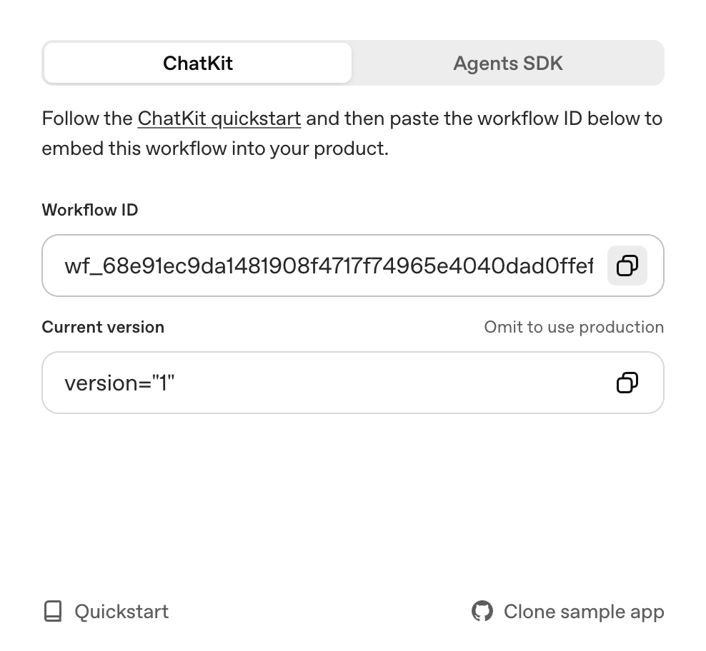

# ChatKit Starter Template

[](LICENSE)


This repository is the simplest way to bootstrap a [ChatKit](http://openai.github.io/chatkit-js/) application. It ships with a minimal Next.js UI, the ChatKit web component, and a ready-to-use session endpoint so you can experiment with OpenAI-hosted workflows built using [Agent Builder](https://platform.openai.com/agent-builder).

## Repository layout (monorepo)

This is an npm workspaces monorepo with two independently deployable apps:

```text
apps/
├── web/    # Next.js + ChatKit frontend (production: Vercel)
└── agent/  # Standalone LangGraph.js Agent Server (production: Docker)
packages/
└── shared-types/  # Types/schemas shared between web and agent
docker-compose.yml # Local-dev-only orchestration for web + agent
```

`apps/web` and `apps/agent` are separate npm workspaces with independent
`package.json`, dependencies, and Dockerfiles. Docker Compose is only a local
development convenience — production deploys each app independently (web to
Vercel, agent as its own container image).

## What You Get

- Next.js app with `<openai-chatkit>` web component and theming controls, in [apps/web](apps/web)
- API endpoint for creating a session at [apps/web/app/api/create-session/route.ts](apps/web/app/api/create-session/route.ts)
- Config file for starter prompts, theme, placeholder text, and greeting message
- A standalone LangGraph.js Agent Server skeleton in [apps/agent](apps/agent), ready for `langgraph dev` / LangGraph Studio

## Getting Started

### Option A — Docker Compose (recommended, lowest setup effort)

```bash
git clone ...
cp .env.example .env
cp apps/web/.env.example apps/web/.env.local
cp apps/agent/.env.example apps/agent/.env.local
docker compose up
```

- Web: http://localhost:3000
- Agent API: http://localhost:2024

### Option B — Run web and agent independently on the host

```bash
npm install

# terminal 1
npm run dev:web       # or: cd apps/web && npm run dev

# terminal 2
npm run dev:agent     # or: cd apps/agent && npx langgraphjs dev

# both at once
npm run dev
```

When running natively, [apps/web](apps/web) reaches the agent via
`LANGGRAPH_API_URL=http://localhost:2024`. Inside Docker Compose the web
container instead uses `LANGGRAPH_API_URL=http://agent:2024` — see the root
[.env.example](.env.example) for details.

### 1. Install dependencies

```bash
npm install
```

### 2. Create your environment file

Copy the example file and fill in the required values:

```bash
cp apps/web/.env.example apps/web/.env.local
```

You can get your workflow id from the [Agent Builder](https://platform.openai.com/agent-builder) interface, after clicking "Publish":



You can get your OpenAI API key from the [OpenAI API Keys](https://platform.openai.com/api-keys) page.

### 3. Configure ChatKit credentials

Update `.env.local` with the variables that match your setup.

- `OPENAI_API_KEY` — This must be an API key created **within the same org & project as your Agent Builder**. If you already have a different `OPENAI_API_KEY` env variable set in your terminal session, that one will take precedence over the key in `.env.local` one (this is how a Next.js app works). So, **please run `unset OPENAI_API_KEY` (`set OPENAI_API_KEY=` for Windows OS) beforehand**.
- `NEXT_PUBLIC_CHATKIT_WORKFLOW_ID` — This is the ID of the workflow you created in [Agent Builder](https://platform.openai.com/agent-builder), which starts with `wf_...`
- (optional) `CHATKIT_API_BASE` - This is a customizable base URL for the ChatKit API endpoint

> Note: if your workflow is using a model requiring organization verification, such as GPT-5, make sure you verify your organization first. Visit your [organization settings](https://platform.openai.com/settings/organization/general) and click on "Verify Organization".

### 4. Run the app

```bash
npm run dev:web
```

Visit `http://localhost:3000` and start chatting. Use the prompts on the start screen to verify your workflow connection, then customize the UI or prompt list in [apps/web/lib/config.ts](apps/web/lib/config.ts) and [apps/web/components/ChatKitPanel.tsx](apps/web/components/ChatKitPanel.tsx).

### 5. Deploy your app

```bash
npm run build:web
```

`apps/web` deploys independently (e.g. to Vercel) from `apps/agent`, which
ships as its own Docker image — see [apps/agent/Dockerfile](apps/agent/Dockerfile).
Setting the deployed agent's URL as `LANGGRAPH_API_URL` for the deployed web
app connects the two in production.

Before deploying your app, you need to verify the domain by adding it to the [Domain allowlist](https://platform.openai.com/settings/organization/security/domain-allowlist) on your dashboard.

## Customization Tips

- Adjust starter prompts, greeting text, [chatkit theme](https://chatkit.studio/playground), and placeholder copy in [apps/web/lib/config.ts](apps/web/lib/config.ts).
- Update the event handlers inside [apps/web/components/ChatKitPanel.tsx](apps/web/components/ChatKitPanel.tsx) to integrate with your product analytics or storage.

## Adding a new agent tool (LangGraph + assistant-ui)

The LangGraph-based chat UI (`apps/trial-chat/chat-v2`, built on
`@assistant-ui/react` + `@assistant-ui/react-langgraph`) supports model tool
calls end-to-end, with a custom React component per tool for rendering
searching/result/error states inline in the thread. This section uses the
`get_trials` clinical-trial-search tool as a worked example; follow the same
four steps to add a new one.

### 1. Define the tool on the agent (`apps/agent`)

Tools live in [apps/agent/src/tools/index.ts](apps/agent/src/tools/index.ts),
built with LangChain's `tool()` helper and a zod schema:

```ts
export const getTrials = tool(
  async (input) => {
    // ...call an API, a DB, etc.
    return { success: true, count, trials, summary };
  },
  {
    name: "get_trials",
    description: "Search for clinical trials matching patient criteria...",
    schema: getTrialsSchema, // zod object — becomes the model-visible args schema
  },
);

export const tools = [getTrials];
```

Keep the tool's return value **JSON-serializable and flat** — normalize any
nested/awkward upstream API response into the shape your UI component wants
to render (see `flattenTrial()` in the same file), rather than pushing that
mapping into the frontend.

Then bind the tool list to the model and let it decide when to call it —
already wired in [apps/agent/src/nodes/callModel.ts](apps/agent/src/nodes/callModel.ts)
(`new ChatOpenAI(...).bindTools(tools)`) and looped through a `ToolNode` in
[apps/agent/src/graph.ts](apps/agent/src/graph.ts) via
`addConditionalEdges("callModel", toolsCondition, { tools: "tools", [END]: END })`.
Adding a new tool to the `tools` array is enough to make it available in the
graph — no graph/node changes needed per tool.

Finally, mention the tool and any hard rules (e.g. "never invent a result,
only report what the tool returned") in
[apps/agent/src/prompts/system.ts](apps/agent/src/prompts/system.ts) — models
are much less likely to call (or correctly rely on) a tool that isn't
described in the system prompt.

### 2. Enable the tool's UI on the frontend (`apps/web`)

Tool-call rendering is configured per-message in
[apps/web/components/assistant-ui/thread.tsx](apps/web/components/assistant-ui/thread.tsx),
inside `AssistantMessage`:

```tsx
<MessagePrimitive.Content
  components={{
    Text: MarkdownText,
    tools: {
      by_name: { get_trials: GetTrialsToolUI }, // enable: map tool name -> component
      Fallback: ToolCallFallback,               // any tool not in by_name renders here
    },
  }}
/>
```

- **Enable** a tool's custom UI by adding a `toolName: Component` entry to
  `by_name`.
- **Disable** a tool's custom UI (fall back to the generic renderer) by
  removing its entry from `by_name` — it will then render via `Fallback`
  instead of a bespoke component. There's no separate "off switch"; `by_name`
  is the allowlist.
- If you want a tool call to render nothing at all, map it to a component
  that returns `null`.

### 3. Write the tool-call UI component

Tool-call components are plain
`ToolCallMessagePartComponent<TArgs, TResult>` components — see
[apps/web/components/assistant-ui/tool-ui.tsx](apps/web/components/assistant-ui/tool-ui.tsx)'s
`GetTrialsToolUI` for the full example. They receive `args`, `status`, and
`result` as props and are expected to branch on `status.type`:

```tsx
export const GetTrialsToolUI: ToolCallMessagePartComponent<
  GetTrialsArgs,
  GetTrialsResult
> = ({ args, status, result: rawResult }) => {
  if (status.type === "running" || status.type === "requires-action") {
    return <SearchingState args={args ?? {}} />;     // 调用中 / 等待中
  }

  // LangGraph's ToolNode serializes non-string tool results to a JSON
  // string before they reach the wire; @assistant-ui/react-langgraph passes
  // that string through as `result` unchanged — parse it back into an object.
  const result =
    typeof rawResult === "string" ? safeJsonParse(rawResult) : rawResult;

  if (status.type === "incomplete" || result?.success === false) {
    return <ErrorState message={result?.error ?? "..."} />; // 出错
  }

  const trials = result?.trials ?? [];
  if (trials.length === 0) {
    return <EmptyState />;                              // 成功但无结果
  }

  return <ResultList trials={trials} />;                // 成功且有结果
};
```

`status.type` is one of `"running"`, `"requires-action"`, `"complete"`, or
`"incomplete"` (see `ToolCallMessagePartStatus` from `@assistant-ui/react`).
**Important:** always parse `result` defensively before reading its fields —
`@assistant-ui/react-langgraph` forwards whatever `ToolMessage.content`
LangGraph produced, which is a JSON **string**, not an object, for any tool
that doesn't return a plain string.

### 4. Verify end-to-end

- Call the agent API directly to confirm the tool's return shape without any
  frontend involved:
  ```bash
  curl -s -X POST http://localhost:2024/runs/wait \
    -H "Content-Type: application/json" \
    -d '{"assistant_id":"<id from /assistants/search>","input":{"messages":[{"role":"user","content":"Find Alzheimers trials in SF"}]}}' \
    | python3 -m json.tool
  ```
  Look for a `"type": "tool"` message in the response — its `content` is the
  JSON string your `by_name` component will need to parse.
- Then exercise it through the real UI at `/trial-chat/chat-v2` to confirm
  the searching/result/error states all render as expected.
- After changing `apps/agent/src/**` or `apps/web/components/**` source
  files only (no new npm dependency), Docker Compose hot-reloads both dev
  servers automatically — no rebuild needed. A rebuild
  (`docker compose up -d --build <service>`) is only required after editing
  a `package.json` / installing a new package, since `node_modules` lives in
  a named volume that isn't refreshed by the source bind mount.

## References

- [ChatKit JavaScript Library](http://openai.github.io/chatkit-js/)
- [Advanced Self-Hosting Examples](https://github.com/openai/openai-chatkit-advanced-samples)
